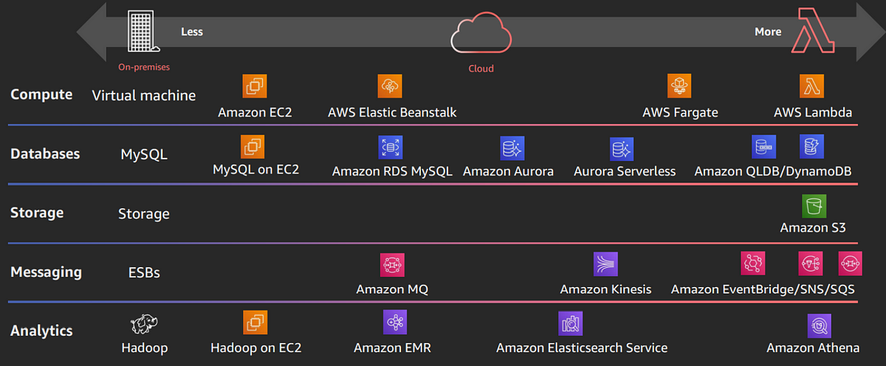
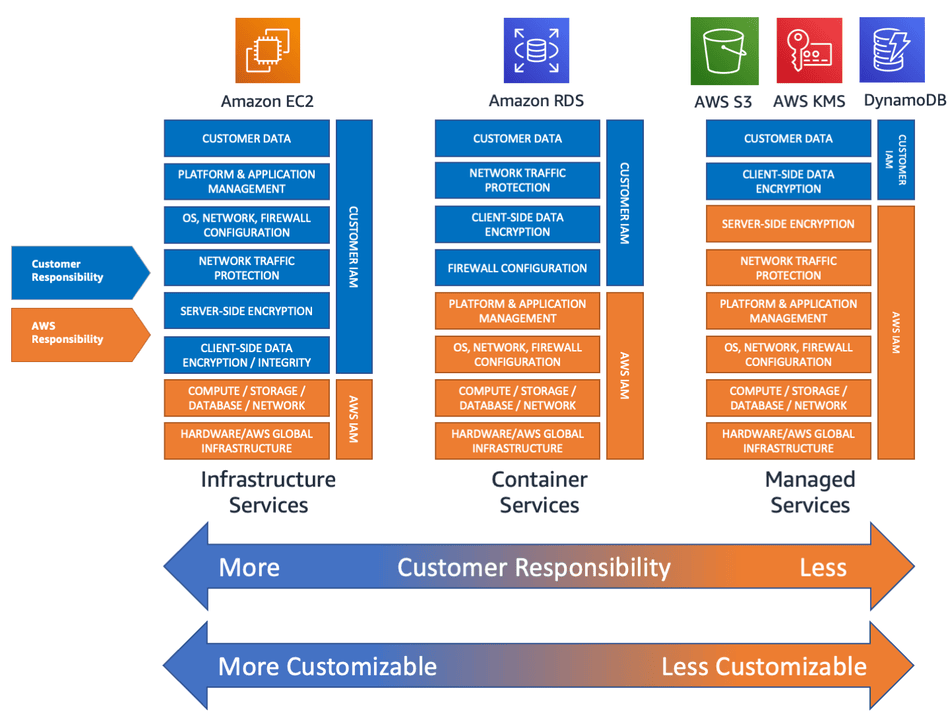
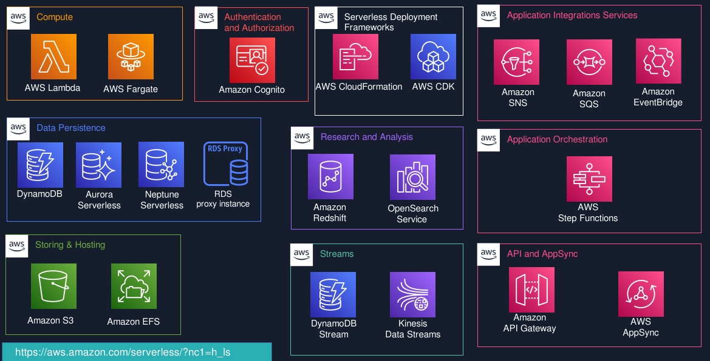
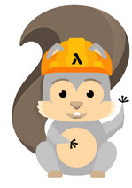
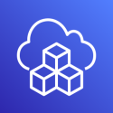
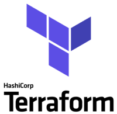

# **Mergulhando no AWS Serverless: Principais serviços e casos de uso**

## **O que é computação sem servidor?**

A computação sem servidor é um modelo inovador de computação em nuvem em que o provedor de nuvem assume a responsabilidade de alocar dinamicamente recursos para executar o código do usuário. Nessa abordagem, os usuários pagam apenas pelos recursos consumidos durante a execução, eliminando as complexidades de provisionamento, dimensionamento e manutenção da infraestrutura.

Para ilustrar esse conceito, considere um aplicativo de e-commerce simples que precisa processar pedidos. Em vez de manter um servidor dedicado que é executado continuamente, um desenvolvedor pode criar uma função usando o AWS Lambda que é acionada sempre que um novo pedido é feito. Quando um pedido chega, essa função é executada, processa o pedido e, em seguida, dimensiona automaticamente sem que o usuário precise gerenciar servidores ou infraestrutura. Os usuários incorrem em custos apenas pelo tempo em que a função está em execução, resultando em economias significativas em comparação aos modelos tradicionais baseados em servidor.

Em uma arquitetura sem servidor, os usuários normalmente desenvolvem e implantam código na forma de funções discretas. Essas funções são projetadas para responder a eventos ou invocações específicas, como carregar uma imagem, processar transações de pagamento ou enviar notificações. O provedor de nuvem lida eficientemente com a alocação de recursos necessários para executar a função, aprimorando ainda mais a experiência do usuário.

Os benefícios da computação sem servidor são numerosos. Ela reduz significativamente a sobrecarga operacional, permite escalabilidade perfeita e oferece eficiência de custo, tornando-a uma solução ideal para aplicativos com cargas de trabalho variáveis ​​ou imprevisíveis. Por exemplo, um aplicativo móvel que experimenta tráfego de usuário flutuante pode aproveitar funções sem servidor para gerenciar solicitações de usuário sem incorrer em custos durante períodos de baixa atividade.

A AWS fornece um rico conjunto de serviços de computação sem servidor, como o AWS Lambda, que permite que os usuários executem código em resposta a eventos, e o AWS Fargate, que permite a execução de aplicativos em contêineres sem gerenciar a infraestrutura do servidor. Juntos, esses serviços tornam mais fácil para os desenvolvedores criar e implantar aplicativos que são ágeis e econômicos, abrindo caminho para uma nova era de desenvolvimento de aplicativos na nuvem.

## **Serverless Explained with AWS Operational Responsibility Model**

Para entendermos como funciona, o AWS Serverless devemos compreender como funciona o Modelo  AWS Operational Responsibility, exemplificado na imagem abaixo:

Ao analisarmos a imagem acima vemos duas extermidades(On-Premisses, serverless) e o meio(cloud) a primeira on premisses, tudo e gerenciado pelo dono do dos serviços ali diponiveis em sua infra ou seja data center.

Abaixo outra imagem que pode nos ajudar a entender ainda mais como esse modelo nos ajuda a diminuir a distribuir a responsabilidade.

A computação sem servidor é um modelo de execução em nuvem em que o provedor de nuvem gerencia automaticamente a infraestrutura e aloca recursos dinamicamente com base nos requisitos do aplicativo. 

Isso significa que os desenvolvedores podem se concentrar em escrever código sem se preocupar com o gerenciamento do servidor. Em vez de provisionar servidores, dimensioná-los e manter o hardware subjacente, os usuários pagam pelo tempo de execução e pelos recursos medidos pelo uso real.

Desta forma quanto mais a esquerda da imagem 1 (On-Premises), neste caso a sua resposabilidade e total, desde compra de servidores, resfriamento do data center, contratação de profissionais especializados,

Já no caso quanto mais a direita(Serverless), neste caso houve a migração para o cloud, e podemos buscar serviços serverless ao qual posso preocupar mais em gerir e transformar meus negocios me preocupando em pagar somente o que necessito ser usado.

## **Quais são os serviços AWS Serverless?**

- **Compute**
    - AWS Lambda
    - AWS Fargate

- **Application integration**
    - Amazon EventBridge
    - Amazon SQS
    - Amazon SNS

- **Application Orchestration**
    - AWS Step Functions
    

- **API and AppSync**
    - Amazon API Gateway
    - AWS AppSync
    - AWS Amplify

- **Authentication and Authorization**
    - Amazon Cognito

- **Storing & Hosting**
    - Amazon S3
    - Amazon EFS

- **Data Persistence**
    - Amazon DynamoDB
    - Amazon RDS Proxy
    - Amazon Aurora Serverless
    - Amazon Redshift Serverless
    - Amazon Neptune Serverless

- **Streams**
    - DynamoDB Stream
    - Kinesis Data Streams

- **Research and Analysis**
    - Amazon OpenSearch Serverless
    - Amazon ElastiCache Serverless

- **Serverless Deployment Frameworks**
    - CloudFormation
    - AWS CDK

## **Conhecendo os principais AWS Serviços Serverless**

### Analysics (Amazon OpenSearch, Amazon ElastiCache, Amazon Redshift): <a href="./analysics/README.md" target="_blank">Acesse aqui</a>

### APIS (Amazon Api Gateway, AWS AppSync, AWS Amplify) :  <a href="./apiGatewayAppSync/README.md" target="_blank">Acesse aqui</a>

### Auth (Amazon Cognito) :  <a href="./auth/README.md" target="_blank">Acesse aqui</a>

### Compute (AWS Lambda, AWS Fargate) :  <a href="./compute/README.md" target="_blank">Acesse aqui</a>

### Database (DynamoDB, RDS Proxy, Amazon Aurora , Amazon Neptune, DynamoDB Streams, Kinesis Data Streams) :  <a href="./database/README.md" target="_blank">Acesse aqui</a>

### Deploy (SAM CloudFormation, AWS CDK (Cloud Development Kit)) :  <a href="./deploy/README.md" target="_blank">Acesse aqui</a>

### Integration (Amazon SNS, Amazon SQS, Amazon EventBridge) :  <a href="./integration/README.md" target="_blank">Acesse aqui</a>

### AWS Step Functions :  <a href="./stepFunctions/README.md" target="_blank">Acesse aqui</a>

### Storage (Amazon S3 (Simple Storage Service), Amazon EFS (Elastic File System)) :  <a href="./storage/README.md" target="_blank">Acesse aqui</a>

## **Como construir, executar e implantar?**

Ao começar a **projetar e construir uma função serverless**, você pode se perguntar como **implementar sua função na nuvem**. Com a AWS, há algumas maneiras de **implementar, testar e invocar sua função**:

Temos algumas que descreveremos abaixo:

### **Usando o AWS Console Management:** 

Você pode criar uma função Lambda diretamente no AWS Management Console, adicionar gatilhos e testar sua função manualmente. Este método é ideal para iniciantes que desejam explorar as funcionalidades do AWS Lambda e verificar como suas funções operam. 

### **AWS CLI:**

Você também pode usar o AWS Lambda CLI para criar, implantar, invocar, gerenciar e monitorar sua função Lambda. Você pode usar comandos existentes para implantar e testar sua função Lambda automaticamente, sem processo manual. **Mas isso não é bom para produção e projetos grandes.**

### **AWS Serverless Application Model (AWS SAM)**

 É uma estrutura de código aberto para criar aplicativos sem servidor. Ele fornece uma sintaxe abreviada para expressar funções, APIs, bancos de dados e mapeamentos de fontes de eventos.

### **AWS Cloud Development Kit (AWS CDK)** 

É uma estrutura de desenvolvimento de software de código aberto para definir seus recursos de aplicativos em nuvem usando linguagens de programação familiares.

### **Serverless Framework**

O Serverless Framework consiste em uma CLI de código aberto e um painel hospedado. Juntos, eles fornecem a você o gerenciamento completo do ciclo de vida do aplicativo serverless.

### **Chalice**

É um framework para escrever aplicativos serverless em Python. Ele permite que você crie e implante rapidamente aplicativos que usam AWS Lambda.

### **Arc.codes** 

Fornece tudo o que você precisa para construir aplicativos serverless massivamente escaláveis ​​com código baixo, configuração clara e concisa e cerimônia zero.

### **Claudia.js** 

Facilita a implantação de projetos Node.js no AWS Lambda e no API Gateway.

### **Terraform** 

É uma ferramenta de infraestrutura como código que permite provisionar e gerenciar recursos em várias nuvens, incluindo a AWS. Você pode usar o Terraform para definir sua infraestrutura serverless com arquivos de configuração HCL (HashiCorp Configuration Language) e facilitar a implementação de recursos.

## **Conclusão**

A arquitetura serverless na AWS oferece uma abordagem **inovadora e eficaz para o desenvolvimento de aplicações**, eliminando a necessidade de **provisionar e gerenciar servidores**. 

Com serviços como **AWS Lambda, Amazon API Gateway, Amazon DynamoDB e AWS Step Functions**, os desenvolvedores têm acesso a uma ampla gama de ferramentas que permitem **construir, implantar e escalar** aplicações de forma rápida e eficiente.

Os principais serviços serverless da AWS não apenas **simplificam o processo de desenvolvimento, mas também proporcionam** flexibilidade e escalabilidade, permitindo que as empresas atendam a demandas **variáveis sem comprometer a performance ou o custo**. 

**Casos de uso que vão desde processamento de dados em tempo real e automação de processos até desenvolvimentos de microserviços e aplicações web modernas** demonstram a versatilidade e a aplicabilidade da **arquitetura serverless** em diversos setores.

À medida que as empresas buscam aumentar a agilidade e **reduzir os custos operacionais**, a adoção de **soluções serverless** se torna cada vez **mais atrativa**. 

As características que permitem que as organizações se concentrem na **lógica de negócios e inovação**, em vez de na gestão de infraestrutura, foram fundamentais para o **crescimento do serverless**. 

Portanto, **mergulhar no ecossistema AWS Serverless** não apenas capacita desenvolvedores e empresas a construir soluções eficazes e de alto desempenho, **mas também as posiciona na vanguarda da transformação digital**, pronta para os desafios e oportunidades do **futuro**.

