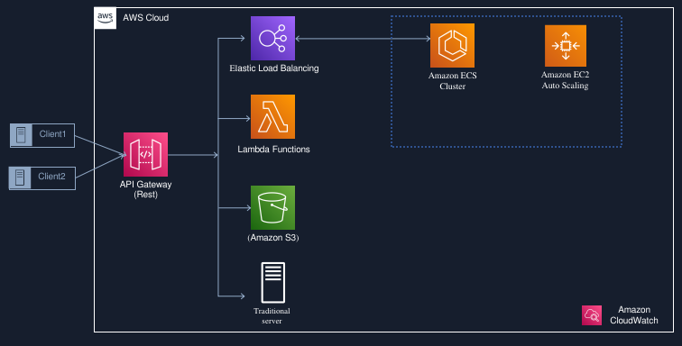

# **07. Amazon API Gateway** 

Um serviço que permite **criar, publicar, manter, monitorar e proteger APIs em escala**. É frequentemente usado em conjunto com o **AWS Lambda** para criar interfaces RESTful serverless.

## Como Funciona um API Gateway?

Um API Gateway atua como um intermediário que permite a comunicação entre diferentes aplicações e serviços, facilitando a troca de dados na rede. Ele recebe solicitações, conhecidas como "chamadas de API", tanto de fontes internas quanto externas, encaminha essas solicitações para a API correspondente e, em seguida, retorna as respostas ao usuário ou dispositivo que fez a requisição.

Por exemplo, imagine que um usuário de um aplicativo precise acessar quatro serviços diferentes para completar um processo. Em vez de permitir que os microserviços se chamem diretamente uns aos outros, realizamos todas as chamadas através do API Gateway. Isso simplifica a comunicação e melhora a gestão das interações entre os serviços.

O Amazon API Gateway é um serviço gerenciado que simplifica o gerenciamento de tarefas comuns relacionadas a APIs, como:

- Roteamento
- Segurança
- Cache
- Controle de Tráfego (Throttling)
- Monitoramento

## Por que usar um API Gateway?

Em sua essência, um API Gateway aceita solicitações remotas e retorna respostas, proporcionando uma experiência simples e confiável para seus clientes.

**Benefícios do API Gateway**

- Proteção contra Abuso: O API Gateway ajuda a proteger suas APIs contra uso excessivo e abusos, permitindo a implementação de funcionalidades de autenticação, autorização e limitação de taxa.
- Facilidade de Análise e Monitoramento: Com funções integradas, ele simplifica a coleta de dados analíticos e o monitoramento do desempenho das APIs.
- Intermediário para Microserviços: Em uma arquitetura de microserviços, uma única solicitação pode exigir chamadas a dezenas de aplicações diferentes. O API Gateway atua como intermediário, facilitando a comunicação entre os serviços.
- Centralização de Serviços: À medida que você adiciona ou atualiza serviços de API, o API Gateway garante que seus usuários encontrem tudo em um único local.

**Desvantagens e Desafios do API Gateway**
- Configuração de Regras de Roteamento: É necessário estabelecer regras de roteamento, o que pode demandar um esforço adicional.
- Potencial Complexidade: Com todas as regras de API concentradas em um único lugar, há o risco de aumento na complexidade do gerenciamento.
- Ponto Único de Falha: O uso de um API Gateway pode introduzir a possibilidade de um ponto único de falha se não for devidamente gerenciado.

###  Segurança do API Gateway
A segurança do API Gateway pode ser dividida em várias categorias principais:

**1. Gerenciamento de Identidade e Acesso**
- O controle de acesso é o principal motor de segurança para a tecnologia de API Gateway.
- Permite que uma organização gerencie quem pode acessar uma API e estabeleça regras sobre como as solicitações de dados são tratadas.
- Com todo o tráfego roteado através de um API Gateway, os especialistas em segurança da TI se sentem mais confiantes em monitorar a segurança da organização.

**2. Segurança das Chamadas de API**
- O API Gateway permite direcionar todas as chamadas de API através de um único ponto, facilitando a avaliação, transformação e proteção das chamadas em toda a infraestrutura.
- Quando o tráfego passa pelo gateway, os especialistas em segurança têm uma visão clara do que está acontecendo e podem implementar mudanças com maior facilidade.

**3. Proteção contra DDoS e Ameaças**
- Sem proteção contra ameaças, o API Gateway e suas APIs, assim como os serviços nativos do servidor de integração, ficam vulneráveis.
- Isso torna o sistema suscetível a ataques, como DDoS ou injeções de SQL, perpetrados por malwares ou invasores anônimos.

**4. Validações de Entrada**
- Validações de entrada inadequadas podem permitir que hackers explorem vulnerabilidades no sistema.
- Ataques podem usar entradas existentes para descobrir o que é aceito ou rejeitado, até encontrar um ponto de entrada para comprometer a integridade da API.

**Principais Tipos de Validações de Entrada:**

- **Tamanho da Mensagem:** Limitar o tamanho da mensagem é essencial, especialmente se você tem certeza de que não receberá mensagens grandes.
- **Injeção de SQL:** A proteção contra injeção de SQL impede que solicitações potencialmente maliciosas sejam processadas.
- **Proteção contra Ameaças XML:** Ataques maliciosos em aplicações XML geralmente envolvem cargas payloads grandes e recursivas, injeções XPath/XSLT ou CData, que podem sobrecarregar o parser e causar falhas no serviço.
- **Limitação de Taxa:** Exigir autenticação de todos os usuários da API e registrar todas as chamadas de API permite aos provedores limitar a taxa de consumo de cada usuário.

### **Funcionalidades do AWS API Gateway**

**A - Gerenciamento de APIs:** Permite criar APIs RESTful e WebSocket com facilidade. Você pode definir endpoints, métodos HTTP, e modelar a resposta e a solicitação dos dados.

**B - Integração com Backend:** Suporta integração com vários serviços AWS como AWS Lambda, EC2, e DynamoDB, além de backends externos, como servidores HTTP.

**C - Modelagem e Validação de Dados:** Possui a capacidade de modelar e validar solicitações e respostas usando schemas JSON.

**D - Gerenciamento de Tráfego:** Permite controle sobre a distribuição do tráfego, incluindo a implementação de throtling e quota de uso, ajudando a proteger seus serviços de picos súbitos de tráfego.

**E - Autenticação e Autorização:** Suporta múltiplas opções de segurança, como autenticação via AWS IAM, Amazon Cognito User Pools, e integração com provedores de identidade externos.

**F - Monitoramento e Logs:** Integrase com o Amazon CloudWatch para fornecer métricas e logs, permitindo monitorar e debugar as APIs de forma eficiente.

**G - Versionamento de APIs:** Permite gerenciar diferentes versões da sua API, facilitando a transição entre versões sem impactar usuários existentes.

**H - CORS (CrossOrigin Resource Sharing):** Facilita a configuração de CORS para permitir chamadas de API de diferentes origens.

**I - Desempenho e Escalabilidade:** O API Gateway é um serviço gerenciado que automaticamente escala para atender à demanda, sem que você precise gerenciar a infraestrutura.

### **Tipos de APIs que o Amazon API Gateway Suporta**

**HTTP API**
- Descrição: API REST de baixo custo e baixa latência.
- Recursos: 
    - Suporte nativo a OIDC e OAuth2.
    - Suporte nativo a CORS.
- Uso: Ideal para construir um CRUD API com AWS Lambda e DynamoDB.

**WebSocket API**
- Descrição: API WebSocket com conexões persistentes.
- Uso: Ideal para casos de uso em tempo real, como aplicações de chat ou dashboards.
- Exemplo: 
    - Construir um aplicativo de chat sem servidor usando WebSocket API, AWS Lambda e DynamoDB. 
    
**REST API**
- Descrição: API REST que oferece controle total sobre requisições e respostas.
- Recursos: Inclui capacidades de gerenciamento de API.
- Uso: Criar uma API Gateway REST API com integração ao AWS Lambda.

**Private REST API**
- Descrição: API REST que pode ser acessada apenas dentro de uma AWS Virtual Private Cloud (VPC).

### **Flexibilidade de Backend**

O Amazon API Gateway permite uma ampla flexibilidade na escolha das tecnologias de backend, incluindo:
- AWS Lambda functions
- AWS Step Functions state machines
- HTTP(s) endpoints hospedados em:
- AWS Elastic Beanstalk
- Amazon EC2
- Outros serviços HTTP hospedados

### **Casos de Uso do AWS API Gateway**

**1. Aplicativos Móveis e Web:** Você pode usar o API Gateway para criar backends escaláveis para aplicativos móveis e web, permitindo que eles se comuniquem com serviços na nuvem.

**2. Microserviços:** Em uma arquitetura de microserviços, o API Gateway atua como um ponto de entrada para as interações entre os serviços, simplificando a comunicação.

**3. APIs Serverless:** Combinando AWS Lambda e API Gateway, você pode criar APIs sem servidor. Isso elimina a necessidade de gerenciar servidores, reduzindo custos e aumentando a eficiência.

**4. Integração com Serviços de Dados:** Use o API Gateway para expor dados de serviços como S3, DynamoDB e outros, permitindo consultas e operações de forma fácil e segura.

**5. WebSockets:** Crie aplicações em tempo real, como chats ou atualizações em tempo real, usando a funcionalidade de WebSocket do API Gateway.

**6. Exposição de Serviços de Terceiros:** O API Gateway pode agir como um proxy, permitindo que você exponha APIs de serviços externos de uma maneira controlada e segura.

**7. Serviços de IoT:** Ideal para conectar dispositivos IoT com backends, permitindo que dispositivos se comuniquem com a nuvem de forma segura e escalável.

# **08. AWS AppSync** 

**Introdução ao GraphQL e AWS AppSync**

No dinâmico mundo do desenvolvimento de aplicativos móveis e da web, a eficiência e os recursos em tempo real não são apenas vantagens desejáveis — eles se tornaram indispensáveis. 

Imagine que você está em um restaurante e, em vez de fazer múltiplos pedidos para obter todos os pratos que deseja, você pode simplesmente fazer um único pedido que inclui tudo de uma vez. 

É exatamente isso que o **GraphQL e o AWS AppSync** trazem para o cenário de desenvolvimento, permitindo que os desenvolvedores construam aplicativos dinâmicos e escaláveis com facilidade.

**GraphQL,** que foi idealizado pelo **Facebook em 2012 e lançado publicamente em 2015**, é uma linguagem de consulta para APIs e um ambiente de execução que permite realizar consultas com um sistema de tipos definido para seus dados. 

Diferentemente das APIs REST tradicionais, que muitas vezes exigem que os desenvolvedores façam carregamentos de várias URLs, o GraphQL possibilita que todas as informações necessárias para o seu aplicativo **sejam obtidas em um único pedido.** Isso garante uma experiência mais fluida e eficiente, mesmo em conexões móveis lentas — **imagine receber uma grande refeição de uma só vez, em vez de esperar por pratos individuais.**

Por outro lado, **temos o AWS AppSync**, que pode ser considerado o **“GraphQL da AWS”**. Ele é um serviço gerenciado que simplifica ainda mais o processo de desenvolvimento, **criando APIs GraphQL e de Pub/Sub sem servidor**. 

Pense no AppSync como um **maestro em uma orquestra:** ele coordena todos os **diferentes instrumentos (ou serviços)** para que eles **toquem em harmonia**. Com um único ponto de extremidade, **os desenvolvedores podem consultar, atualizar ou publicar dados de forma segura e eficiente,** permitindo a criação de aplicativos interativos e ricos em recursos.

Em resumo, **tanto o GraphQL quanto o AWS AppSync** não apenas economizam tempo e recursos, mas também melhoram a experiência do usuário, transformando a maneira como interagimos com dados e construímos aplicativos. 

Prepare-se para explorar essas ferramentas poderosas que **irão elevar o nível do seu desenvolvimento!**

### **Principais recursos do GraphQL**

**1. Consultas Precisamente Definidas**
- O GraphQL permite que os desenvolvedores especifiquem exatamente quais dados desejam em suas consultas. 
- É como fazer um pedido personalizado em uma loja de sanduíches: em vez de receber um sanduíche padrão, você pode solicitar exatamente os ingredientes que deseja, sem um único item desnecessário. 
- Isso minimiza o desperdício e garante que você obtenha exatamente o que precisa, otimizando a eficiência da sua aplicação.

**2. Uma Única Solicitação, Muitas Respostas**
- Com GraphQL, você pode buscar todos os dados necessários em uma única solicitação, ao contrário das APIs REST, que muitas vezes requerem várias chamadas. 
- Imagine que você está organizando uma festa e, em vez de fazer várias viagens ao supermercado (uma para bebidas, outra para salgadinhos, outra para sobremesas), você pode fazer um único pedido de entrega que inclua tudo o que precisa para a festa. 
- Isso reduz a latência e torna o carregamento dos dados muito mais rápido.

**3. Tipagem Forte**
- GraphQL utiliza um sistema de tipos forte, permitindo que os desenvolvedores definam estruturas claras para os dados. 
- Pense nisso como um mapa detalhado de uma cidade: ao seguir um mapa bem definido, você pode encontrar o que procura com facilidade, sem se perder. 
- Essa tipagem forte ajuda a evitar erros e facilita a manutenção do código, proporcionando segurança nas interações com a API.

**4. Evolução Sem Quebra**
- Uma das grandes vantagens do GraphQL é sua capacidade de evoluir sem quebrar a compatibilidade com versões anteriores. 
- É como uma árvore em crescimento: à medida que novos ramos são adicionados, a árvore continua a florescer, mas as raízes permanecem firmemente plantadas. 
- Isso significa que novas funcionalidades podem ser adicionadas sem impactar negativamente os clientes que já utilizam uma versão anterior da API.

**5. Subscrições em Tempo Real**
- GraphQL suporta subscrições, permitindo que os aplicativos recebam atualizações em tempo real. 
- Pense nisso como um serviço de alerta meteorológico – em vez de você checar constantemente a temperatura, você se inscreve para receber uma notificação assim que houver mudanças significativas. 
- Isso torna os aplicativos mais dinâmicos e responsivos, oferecendo uma experiência do usuário mais rica.

**6. Ferramentas Ricas e Ecosystema**
- O ecossistema ao redor do GraphQL é vibrante, com várias ferramentas e bibliotecas que facilitam o desenvolvimento. 
- Imagine uma caixa de ferramentas bem equipada: cada ferramenta tem um propósito específico e pode facilitar sua vida de diversas maneiras. 
- Seja para consultas, gerenciamento de dados ou integrações, o GraphQL possui uma ampla gama de recursos que tornam o desenvolvimento mais eficiente e agradável.

**7. Documentação Automática**
- Por fim, com o GraphQL, a documentação é gerada automaticamente a partir do esquema. 
- Isso é como ter um assistente pessoal que acompanha seu dia a dia e anota todas as suas atividades e compromissos. 
- Assim, quando você precisar consultar o que fez, as informações estarão sempre acessíveis e organizadas, ajudando você a compreender melhor como interagir com a API.

### **Operações GraphQL**

**Temos 3 operações diferentes em GraphQL:**

- **Consulta :** usada para recuperar dados, como uma solicitação GET.
- **Mutação :** usada para modificar dados, como CRIAR, ATUALIZAR ou EXCLUIR.
- **Assinatura :** usada para assinar as alterações de dados e receber notificações em tempo real.

### **A grande pergunta e por que escolher o AppSync?**

Escolher o AWS AppSync para o desenvolvimento de aplicações que utilizam GraphQL pode trazer uma série de benefícios significativos. Abaixo, apresento algumas razões, acompanhadas de casos reais que ilustram como empresas estão aproveitando o AppSync para alcançar seus objetivos:

**1. Desenvolvimento Rápido e Simplificado**
Caso Real: A startup de tecnologia educacional Knowt, de rápido crescimento, desenvolveu um aplicativo inovador que muda como alunos e professores estudam e criam tarefas. Utilizando um algoritmo eficaz e inteligência artificial, o aplicativo converte rapidamente anotações em questionários e flashcards. Fundado em 2016 por Abheek Pandoh e Daniel Like, a Knowt surgiu da identificação de uma oportunidade de melhorar o estudo através das anotações dos alunos. Começou com um aplicativo para Android e rapidamente se expandiu para iOS e a Web.[link](https://aws.amazon.com/solutions/case-studies/knowt/?nc1=h_ls)

**2. Integração de Dados em Tempo Real**
Caso Real:  Sky Italia queria oferecer uma melhor experiência aos fãs de esportes enviando atualizações de dados em tempo real durante transmissões ao vivo de eventos esportivos e, usando o AWS AppSync, eles conseguiram otimizar as transferências de dados durante os horários de pico de tráfego e fornecer atualizações esportivas aos espectadores em milissegundos. [link](https://aws.amazon.com/pt/blogs/mobile/appsync-real-time-live-sports/)

**3. Escalabilidade Automática**
Caso Real:  O Amazon Music, para proporcionar uma experiência de streaming envolvente e de baixa latência, decidiu construir um sistema de enfileiramento centralizado e baseado em nuvem. Esse sistema também possui armazenamento no dispositivo, permitindo reprodução offline e sincronização automática de dados entre os clientes e o sistema central, o que é fundamental para lidar com o uso intenso de milhões de usuários alternando entre dispositivos e conectividade de rede.[link](https://aws.amazon.com/solutions/case-studies/amazonmusic-amplify-appsync-case-study/?nc1=h_ls)

**4. Gerenciamento Simplificado de API**
Caso Real: A Automatic Data Processing (ADP) buscava modernizar suas principais soluções, MyADP e ADP Mobile, visando proporcionar uma experiência perfeita para seus mais de 17 milhões de usuários. Como uma empresa global de tecnologia especializada em serviços de gestão de capital humano (HCM) e folha de pagamento, a ADP está comprometida em criar produtos inovadores. Para isso, a baixa latência e uma experiência de usuário de alta qualidade são fundamentais. [link](https://aws.amazon.com/solutions/case-studies/adp-appsync-case-study/?nc1=h_ls)

**5. Melhoria na Experiência do Usuário**
Caso Real: A ResMed, líder em saúde digital, é uma das principais fornecedoras globais de soluções conectadas à nuvem para pessoas com apneia do sono, DPOC, asma e outras condições crônicas. Em 2021, a empresa já havia impactado a vida de mais de 133 milhões de pessoas em mais de 140 países e agora visa melhorar 250 milhões de vidas até 2025. Para alcançar essa ambiciosa meta, a ResMed precisa de uma solução ágil e sem servidor que eleve a satisfação do usuário e atenda a uma crescente demanda.

Para atender a essa necessidade, a ResMed adotou as soluções da Amazon Web Services (AWS) para escalar seu suporte a mais usuários globalmente, reduzir a latência do aplicativo e implementar novos recursos rapidamente. Ao desenvolver seu aplicativo myAir, a empresa optou pelo AWS AppSync, que é um serviço de API GraphQL e Pub/Sub sem servidor, facilitando a construção de aplicativos modernos para web e dispositivos móveis. Combinado com outras soluções da AWS, o AppSync permitirá à ResMed reduzir a sobrecarga operacional, aprimorar a experiência do usuário e fornecer insights mais precisos e valiosos por meio de aprendizado de máquina. Esse foco na melhoria da experiência do usuário não apenas aumenta a satisfação, mas também potencializa a capacidade da ResMed de cumprir sua missão de impactar positivamente a vida de milhões de pessoas. [link](https://aws.amazon.com/solutions/case-studies/resmed-case-study/)

**7. Fácil Manutenção e Evolução**
Caso Real: O artigo "Adding Real-Time Interactivity to Your Live Streams with AWS AppSync" explora como implementar interatividade em transmissões ao vivo utilizando o AWS AppSync. Ele descreve a importância de engajar os espectadores por meio de recursos como bate-papo ao vivo, enquetes e reações durante os eventos. O autor apresenta um exemplo prático de uma aplicação que integra o AppSync com um front-end React, permitindo comunicação em tempo real com streams da AWS. Além disso, o artigo detalha a configuração de subcrições GraphQL para facilitar a interação instantânea, melhorando a experiência do usuário e aumentando o envolvimento durante as transmissões.
[link](https://dev.to/aws/adding-real-time-interactivity-to-your-live-streams-with-aws-appsync-4gip)

**8. Segurança Aprimorada**
No contexto atual, onde a segurança da informação é uma prioridade essencial para empresas de todos os setores, o AWS AppSync se destaca como uma solução robusta que aprimora a segurança de aplicações. 

As empresas mencionadas em nossos exemplos comprovam como a implementação do AppSync não só melhora a eficiência e a experiência do usuário, mas também fortalece a proteção dos dados. O AppSync facilita a implementação de autenticação e autorização de nível superior, garantindo que informações sensíveis sejam acessadas apenas por usuários autorizados.

### **Agora, vamos ver como esses recursos podem ser aplicados em cenários do mundo real:**

**1 - Aplicativos móveis e da Web:** Perfeito para criar backends escaláveis ​​para aplicativos que interagem dinamicamente com dados, como redes sociais ou mercados.
**2 - Bate-papo em tempo real:** O recurso de assinatura em tempo real torna o AppSync ideal para plataformas de bate-papo, fornecendo entrega instantânea de mensagens.
**3 - Aplicativos de colaboração:** Permite que os usuários trabalhem juntos em tempo real, como em editores de documentos ou plataformas de arquivos, com atualizações dinâmicas para todos.
**4 - Painéis interativos:** Fornece uma experiência de painel rica e envolvente, permitindo consultas eficientes e visualizações dinâmicas.
**5 - Integração de serviços complexos:** Unifica dados de várias fontes em uma única API, ideal para aplicativos que exigem uma ampla gama de informações integradas.
**6 - Aplicativos OfflineFirst:** 
- O suporte para modos offline garante que seus aplicativos funcionem sem uma conexão com a Internet, sincronizando as alterações assim que a conexão for restaurada.
- No onlinefirst, o aplicativo usa mais APIs, simplificando o desenvolvimento.
- Você se preocupa menos com dados locais, armazenamento e sincronização.
- O cache se torna um recurso temporário, que armazena dados leves

### **Componentes de uma API GraphQL**

[Componentes de uma API GraphQL](https://docs.aws.amazon.com/pt_br/appsync/latest/devguide/api-components.html)

### **Existem 3 componentes principais em uma API GraphQL**

**Schemas**
- Funcionam como um gateway que gerencia todas as solicitações ao servidor.
- Atuam como o único ponto final para interface com o cliente.
- Acessam, processam e retransmitem dados da fonte de dados para o cliente.

**Data Sources**
- Podem incluir DynamoDB, Lambda, OpenSearch, endpoints HTTP, EventBridge, bancos de dados relacionais, entre outros.

**Resolvers**
- Unidade de código responsável por determinar como os dados de um campo serão resolvidos durante uma solicitação.

[componentes principais em uma API GraphQL](https://docs.aws.amazon.com/appsync/latest/devguide/data-source-components.html)

ENGLISH 

Unlocking the Power of AWS API Gateway and AWS AppSync: Transforming API Development, Functionality, and Use Cases

# **07. Amazon API Gateway**

A service that enables **creating, publishing, maintaining, monitoring, and securing APIs at scale**. It is often used in conjunction with **AWS Lambda** to create serverless RESTful interfaces.

## How Does an API Gateway Work?

An API Gateway acts as an intermediary that enables communication between different applications and services, facilitating the exchange of data over the network. It receives requests, known as "API calls", from both internal and external sources, routes these requests to the corresponding API, and then returns the responses to the user or device that made the request.

For example, imagine that a user of an application needs to access four different services to complete a process. Instead of allowing microservices to call each other directly, we make all calls through the API Gateway. This simplifies communication and improves the management of interactions between services.

Amazon API Gateway is a managed service that simplifies the management of common API-related tasks, such as:

- Routing
- Security
- Caching
- Throttling
- Monitoring

## Why use an API Gateway?

At its core, an API Gateway accepts remote requests and returns responses, providing a simple and reliable experience for your customers.

**Benefits of API Gateway**

- Abuse Protection: API Gateway helps protect your APIs from overuse and abuse by enabling you to implement authentication, authorization, and rate limiting capabilities.
- Easy Analytics and Monitoring: With built-in functions, it simplifies the collection of analytics data and monitoring of API performance.
- Broker for Microservices: In a microservices architecture, a single request can require calls to dozens of different applications. API Gateway acts as an intermediary, facilitating communication between services.
- Centralization of Services: As you add or update API services, API Gateway ensures that your users can find everything in one place.

**Disadvantages and Challenges of API Gateway**
- Routing Rules Configuration: Routing rules need to be established, which can require additional effort.
- Potential Complexity: With all API rules concentrated in one place, there is a risk of increased management complexity.
- Single Point of Failure: Using an API Gateway can introduce the possibility of a single point of failure if not properly managed.

### API Gateway Security
API Gateway security can be broken down into several main categories:

**1. Identity and Access Management**
- Access control is the primary security driver for API Gateway technology.
- It allows an organization to manage who can access an API and establish rules for how data requests are handled.
- With all traffic routed through an API Gateway, IT security experts feel more confident in monitoring the organization’s security.

**2. API Call Security**
- API Gateway allows all API calls to be routed through a single point, making it easier to assess, transform, and secure calls across the entire infrastructure.
- When traffic passes through the gateway, security experts have a clear view of what is happening and can more easily implement changes.

**3. DDoS and Threat Protection**
- Without threat protection, API Gateway and its APIs, as well as native integration server services, are vulnerable.

**4. - This makes the system susceptible to attacks, such as DDoS or SQL injections, perpetrated by malware or anonymous attackers.

**4. Input Validations**
- Inadequate input validations can allow hackers to exploit vulnerabilities in the system.
- Attacks can use existing inputs to figure out what is accepted or rejected, until they find an entry point to compromise the integrity of the API.

**Main Types of Input Validations:**

- **Message Size:** Limiting the message size is essential, especially if you are certain that you will not receive large messages.
- **SQL Injection:** SQL injection protection prevents potentially malicious requests from being processed.
- **XML Threat Protection:** Malicious attacks on XML applications usually involve large and recursive payloads, XPath/XSLT or CData injections, which can overload the parser and cause the service to fail. - **Rate Limiting:** Requiring authentication of all API users and logging of all API calls allows providers to limit the consumption rate of each user.

### **AWS API Gateway Features**

**A - API Management:** Allows you to easily create RESTful and WebSocket APIs. You can define endpoints, HTTP methods, and model the response and request data.

**B - Backend Integration:** Supports integration with various AWS services such as AWS Lambda, EC2, and DynamoDB, as well as external backends such as HTTP servers.

**C - Data Modeling and Validation:** Provides the ability to model and validate requests and responses using JSON schemas.

**D - Traffic Management:** Allows you to control traffic distribution, including the implementation of throttling and usage quotas, helping to protect your services from sudden traffic spikes.

**E - Authentication and Authorization:** Supports multiple security options, such as authentication via AWS IAM, Amazon Cognito User Pools, and integration with external identity providers.

**F - Monitoring and Logs:** Integrates with Amazon CloudWatch to provide metrics and logs, allowing you to efficiently monitor and debug your APIs.

**G - API Versioning:** Allows you to manage different versions of your API, making it easier to transition between versions without impacting existing users.

**H - CORS (CrossOrigin Resource Sharing):** Makes it easy to configure CORS to allow API calls from different origins.

**I - Performance and Scalability:** API Gateway is a managed service that automatically scales to meet demand, without you having to manage the infrastructure.

### **Types of APIs that Amazon API Gateway Supports**

**HTTP API**
- Description: Low-cost, low-latency REST API.
- Features:
- Native support for OIDC and OAuth2.
- Native CORS support.
- Usage: Ideal for building a CRUD API with AWS Lambda and DynamoDB.

**WebSocket API**
- Description: WebSocket API with persistent connections.
- Usage: Ideal for real-time use cases, such as chat applications or dashboards.
- Example:
- Building a serverless chat application using WebSocket API, AWS Lambda, and DynamoDB.

**REST API**
- Description: REST API that offers full control over requests and responses.
- Features: Includes API management capabilities.
- Usage: Create an API Gateway REST API with AWS Lambda integration.

**Private REST API**
- Description: REST API that can only be accessed within an AWS Virtual Private Cloud (VPC).

### **Backend Flexibility**

**Amazon API Gateway allows you to have broad flexibility in choosing backend technologies, including:**

- **AWS Lambda:** To execute serverless functions in response to API calls.
- **Amazon DynamoDB:** To store and retrieve data in a NoSQL table.
- **Amazon RDS:** To access relational databases (such as MySQL, PostgreSQL).
- **Amazon Aurora:** A relational database compatible with MySQL and PostgreSQL.
- **Amazon S3:** To serve static content and store files.
- **AWS Step Functions:** To orchestrate calls to multiple AWS services in a workflow.
- **Amazon SNS (Simple Notification Service):** To send notifications.
- **Amazon SQS (Simple Queue Service):** To queue and process messages.
- **AWS AppSync:** To implement GraphQL APIs.
- **Amazon CloudFront:** To deliver content through a content delivery network (CDN). - **Amazon Kinesis:** For receiving and processing real-time data streams.
- **AWS IAM (Identity and Access Management):** For managing permissions and authentication.
- **Amazon Cognito:** For user authentication and identity management.
- **Amazon EventBridge:** For integrating events from different AWS services.
- **Elastic Load Balancing (ELB):** For routing traffic to EC2 instances and other services.
- **Amazon EC2:** For accessing virtual server instances.
- **Amazon ECS (Elastic Container Service):** For running containers.
- **Amazon EKS (Elastic Kubernetes Service):** For managing Kubernetes clusters.
- **Amazon Textract:** For extracting text and data from documents.
- **AWS Step Functions:** For building complex workflows.

### **AWS API Gateway Use Cases**

**1. Mobile and Web Applications:** You can use API Gateway to build scalable backends for mobile and web applications, enabling them to communicate with cloud services.

**2. Microservices:** In a microservices architecture, API Gateway acts as an entry point for interactions between services, simplifying communication.

**3. Serverless APIs:** By combining AWS Lambda and API Gateway, you can build serverless APIs. This eliminates the need to manage servers, reducing costs and increasing efficiency.

**4. Data Service Integration:** Use API Gateway to expose data from services such as S3, DynamoDB, and others, enabling easy and secure queries and operations.

**5. WebSockets:** Build real-time applications, such as chats or real-time updates, using API Gateway's WebSocket functionality.

**6. Third-Party Service Exposure:** API Gateway can act as a proxy, allowing you to expose APIs from external services in a controlled and secure manner.

**7. IoT Services:** Ideal for connecting IoT devices to backends, allowing devices to communicate with the cloud in a secure and scalable manner.

----------------------------------------------------------------------------------

# **08. AWS AppSync**

**Introduction to GraphQL and AWS AppSync**

In the fast-paced world of web and mobile app development, efficiency and real-time capabilities are not just nice-to-haves—they’ve become must-haves.

Imagine that you’re at a restaurant and instead of placing multiple orders to get all the dishes you want, you can simply place a single order that includes everything at once.

That’s exactly what **GraphQL and AWS AppSync** bring to the development landscape, enabling developers to build dynamic, scalable apps with ease.

**GraphQL,** which was conceived by **Facebook in 2012 and publicly released in 2015**, is a query language for APIs and a runtime environment that lets you query your data with a type system that’s defined.

Unlike traditional REST APIs, which often require developers to load multiple URLs, GraphQL makes it possible to get all the information your application needs in a single request. This ensures a smoother and more efficient experience, even on slow mobile connections — imagine getting a large meal all at once, instead of waiting for individual dishes. On the other hand, AWS AppSync can be thought of as the “GraphQL of AWS.” It’s a managed service that further simplifies the development process by creating serverless GraphQL and Pub/Sub APIs. Think of AppSync as a conductor in an orchestra: it coordinates all the different instruments (or services) so that they play in harmony. With a single endpoint, developers can securely and efficiently query, update, or publish data, enabling them to build interactive, feature-rich applications. In short, **both GraphQL and AWS AppSync** not only save time and resources, but also improve the user experience by transforming the way we interact with data and build applications.

Get ready to explore these powerful tools that **will take your development to the next level!**

### **Key Features of GraphQL**

**1. Precisely Defined Queries**
- GraphQL allows developers to specify exactly what data they want in their queries.
- It’s like placing a custom order at a sandwich shop: instead of getting a standard sandwich, you can order exactly the ingredients you want, without a single unnecessary item.
- This minimizes waste and ensures you get exactly what you need, optimizing the efficiency of your application.

**2. Single Request, Many Responses**
- With GraphQL, you can fetch all the data you need in a single request, unlike REST APIs, which often require multiple calls.
- Imagine you’re hosting a party, and instead of making multiple trips to the grocery store (one for drinks, one for snacks, one for dessert), you can place a single delivery order that includes everything you need for the party.
- This reduces latency and makes loading data much faster.

**3. Strong Typing**
- GraphQL uses a strong type system, allowing developers to define clear structures for their data.
- Think of it like a detailed map of a city: by following a well-defined map, you can easily find what you’re looking for without getting lost.
- This strong typing helps prevent errors and makes code maintenance easier, providing security for interactions with the API.

**4. Evolution Without Breaking**
- One of the great advantages of GraphQL is its ability to evolve without breaking backwards compatibility.
- It’s like a growing tree: as new branches are added, the tree continues to flourish, but the roots remain firmly planted.
- This means that new functionality can be added without negatively impacting clients already using a previous version of the API.

**5. Real-Time Subscriptions**
- GraphQL supports subscriptions, allowing applications to receive updates in real time.
- Think of it as a weather alert service – instead of constantly checking the temperature, you subscribe to receive a notification as soon as there are significant changes.
- This makes applications more dynamic and responsive, offering a richer user experience.

**6. Rich Tools and Ecosystem**
- The ecosystem around GraphQL is vibrant, with several tools and libraries that facilitate development.
- Think of it as a well-stocked toolbox: each tool has a specific purpose and can make your life easier in different ways.
- Whether for queries, data management or integrations, GraphQL has a wide range of features that make development more efficient and enjoyable.

**7. Automatic Documentation**
- Finally, with GraphQL, documentation is automatically generated from the schema.
- This is like having a personal assistant that follows your daily life and notes all your activities and appointments. - So when you need to check what you did, the information will always be accessible and organized, helping you better understand how to interact with the API.

### **GraphQL Operations**

**We have 3 different operations in GraphQL:**

- **Query :** used to retrieve data, such as a GET request.

- **Mutation :** used to modify data, such as CREATE, UPDATE or DELETE.

- **Subscription :** used to subscribe to data changes and receive real-time notifications.

### **The big question and why choose AppSync?**

Choosing AWS AppSync for developing applications that use GraphQL can bring a number of significant benefits. Below, I present some reasons, accompanied by real-world cases that illustrate how companies are leveraging AppSync to achieve their goals:

**1. Rapid and Simplified Development**
Real-World Case Study: Fast-growing education technology startup Knowt has developed an innovative app that changes how students and teachers study and create assignments. Using a powerful algorithm and artificial intelligence, the app quickly converts notes into quizzes and flashcards. Founded in 2016 by Abheek Pandoh and Daniel Like, Knowt was born from an opportunity to improve learning through student note-taking. It started as an Android app and quickly expanded to iOS and the web.[link](https://aws.amazon.com/solutions/case-studies/knowt/?nc1=h_ls)

**2. Real-Time Data Integration**
Real Case Study: Sky Italia wanted to provide a better experience to sports fans by sending real-time data updates during live broadcasts of sporting events, and using AWS AppSync, they were able to optimize data transfers during peak traffic times and deliver sports updates to viewers in milliseconds. [link](https://aws.amazon.com/pt/blogs/mobile/appsync-real-time-live-sports/)

**3. Automatic Scalability**
Real Case Study: To provide an engaging, low-latency streaming experience, Amazon Music decided to build a centralized, cloud-based queuing system. This system also features on-device storage, enabling offline playback and automatic data synchronization between clients and the central system, which is critical to handling the heavy usage of millions of users switching between devices and network connectivity.[link](https://aws.amazon.com/solutions/case-studies/amazonmusic-amplify-appsync-case-study/?nc1=h_ls)

**4. Simplified API Management**
Real Case Study: Automatic Data Processing (ADP) was looking to modernize its flagship solutions, MyADP and ADP Mobile, to provide a seamless experience for its 17+ million users. As a global technology company specializing in human capital management (HCM) and payroll services, ADP is committed to building innovative products. To achieve this, low latency and a high-quality user experience are key. [link](https://aws.amazon.com/solutions/case-studies/adp-appsync-case-study/?nc1=h_ls)

**5. Improved User Experience**
Real Case Study: ResMed, a leader in digital health, is a leading global provider of cloud-connected solutions for people with sleep apnea, COPD, asthma, and other chronic conditions. As of 2021, the company has already impacted the lives of more than 133 million people in over 140 countries and now aims to improve 250 million lives by 2025. To achieve this ambitious goal, ResMed needs an agile, serverless solution that will drive user satisfaction and meet growing demand.

To meet this need, ResMed turned to Amazon Web Services (AWS) solutions to scale its support to more users globally, reduce application latency, and quickly implement new features. When developing its myAir app, the company chose AWS AppSync, a serverless GraphQL and Pub/Sub API service that makes it easy to build modern web and mobile applications. Combined with other AWS solutions, AppSync will enable ResMed to reduce operational overhead, improve the user experience, and provide more accurate and valuable insights through machine learning. This focus on improving the user experience not only increases satisfaction, but also enhances ResMed’s ability to fulfill its mission of positively impacting the lives of millions of people. [link](https://aws.amazon.com/solutions/case-studies/resmed-case-study/)

**7. Easy Maintenance and Evolution**
Real Case Study: The article "Adding Real-Time Interactivity to Your Live Streams with AWS AppSync" explores how to implement interactivity in live broadcasts using AWS AppSync. It describes the importance of engaging viewers through features such as live chat, polls, and reactions during events. The author presents a practical example of an application that integrates AppSync with a React front-end, enabling real-time communication with AWS streams. In addition, the article details the configuration of GraphQL subscriptions to facilitate instant interaction, improving the user experience and increasing engagement during broadcasts.
[link](https://dev.to/aws/adding-real-time-interactivity-to-your-live-streams-with-aws-appsync-4gip)

**8. Enhanced Security**
In the current context, where information security is a key priority for companies across all sectors, AWS AppSync stands out as a robust solution that enhances application security.

The companies mentioned in our examples demonstrate how implementing AppSync not only improves efficiency and user experience, but also strengthens data protection. AppSync makes it easy to implement high-level authentication and authorization, ensuring that sensitive information is only accessed by authorized users.

### **Now, let’s see how these features can be applied in real-world scenarios:**

**1 - Mobile and Web Applications:** Perfect for building scalable backends for applications that dynamically interact with data, such as social networks or marketplaces.
**2 - Real-time Chat:** The real-time signing feature makes AppSync ideal for chat platforms, providing instant message delivery.
**3 - Collaboration Applications:** Allows users to work together in real-time, such as in document editors or file platforms, with dynamic updates for everyone.
**4 - Interactive Dashboards:** Provides a rich and engaging dashboard experience, enabling efficient queries and dynamic visualizations.
** **5 - Complex service integration:** Unifies data from multiple sources into a single API, ideal for applications that require a wide range of integrated information.
**6 - OfflineFirst applications:**
- Support for offline modes ensures that your applications work without an Internet connection, synchronizing changes as soon as the connection is restored.
- In onlinefirst, the application uses more APIs, simplifying development.
- You worry less about local data, storage, and synchronization. - The cache becomes a temporary resource, which stores lightweight data

### **Components of a GraphQL API**

[Components of a GraphQL API](https://docs.aws.amazon.com/en_us/appsync/latest/devguide/api-components.html)

### **There are 3 main components in a GraphQL API**

**Schemas**
- They act as a gateway that manages all requests to the server.
- They act as the single endpoint for interfacing with the client.
- They access, process, and relay data from the data source to the client.

**Data Sources**
- Can include DynamoDB, Lambda, OpenSearch, HTTP endpoints, EventBridge, relational databases, and more.

**Resolvers**
- Unit of code responsible for determining how a field's data will be resolved during a request.

[core components in a GraphQL API](https://docs.aws.amazon.com/appsync/latest/devguide/data-source-components.html)