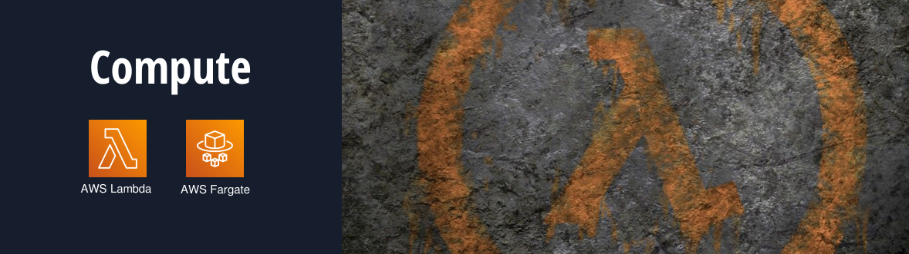

## **01. AWS Lambda** 

O serviço central de computação serverless da AWS, que permite executar código em resposta a eventos, como alterações em dados, **uploads do Amazon S3, atualizações em bancos de dados e chamadas de API.**

AWS Lambda é um serviço que permite executar código em **resposta a eventos sem a necessidade de gerenciar servidores**. Isso o torna ideal para uma variedade de casos de uso. 

Aqui estão alguns exemplos detalhados de como AWS Lambda pode ser utilizado, os serviços abaixo listados podem **disparem eventos que acionam funções lambdas.**

- 1. AWS S3 (Amazon Simple Storage Service)
- 2. Amazon API Gateway
- 3. AWS DynamoDB
- 4. Amazon SNS (Simple Notification Service)
- 5. Amazon SQS (Simple Queue Service)
- 6. AWS CloudWatch Events
- 7. AWS CloudFormation
- 8. Amazon Kinesis
- 9. AWS IoT
- 10. Amazon Cognito
- 11. Amazon CloudFront
- 12. AWS Config
- 13. Amazon EventBridge

### **Quais os principais usos do AWS Lambdas ?**

### **A Processamento de Dados em Tempo Real**

- AWS Lambda pode ser utilizado para processar dados à medida que eles chegam. Por exemplo, você pode configurar uma função Lambda para ser acionada sempre que novos dados forem inseridos em um bucket do Amazon S3. Isso pode ser útil para, **transcodificação de Mídia e  Análise de Logs**.

### **B. Back-End de Aplicações Web e APIs**

-  AWS Lambda pode ser utilizado como uma solução para criar o **back-end de aplicações web** e interligar com **API Gateway** ou mesmo criar uma endPoint diretamente:
-  **APIs RESTful:** Usando Amazon API Gateway em conjunto com Lambda, você pode criar APIs sem servidor que respondem a requisições HTTP. Isso é ideal para aplicações móveis ou web que precisam de uma interface de **programação para manipular dados**.
-  **Autenticação de Usuários:** Lambda pode ser usado para gerenciar a autenticação de usuários, incluindo integrações com serviços de identidade como Amazon Cognito.

### **C. Automação e Orquestração de Workflow**

- AWS Lambda pode ser utilizado para **automatizar tarefas e orquestrar workflows:**
- **Automação de Tarefas de TI**, Você pode usar funções Lambda para automatizar tarefas administrativas, como **iniciar ou parar instâncias do EC2** com base em horários específicos ou condições de uso.
- **Orquestração de Microserviços:** Lambda pode gerenciar chamadas assíncronas entre microserviços, permitindo que diferentes partes de uma aplicação se comuniquem de forma eficaz sem depender de uma arquitetura monolítica.

### **D. Integração com Outros Serviços da AWS**

-  AWS Lambda se integra profundamente com outros serviços da AWS, **possibilitando uma ampla gama de casos de uso:**
- **Ingressar em Notificações em Tempo Real:** Com **Amazon SNS (Simple Notification Service)** e AWS Lambda, você pode criar aplicações que respondem a eventos e enviam notificações em tempo real, como alertas ou mensagens de SMS.
- **Serviços de Mensageria:** As funções Lambda podem ser acionadas em resposta a mensagens em serviços como **Amazon SQS (Simple Queue Service)**, permitindo processar mensagens automaticamente à medida que elas chegam à fila.

### **E. Desenvolvimento de Chatbots e Assistentes Virtuais**

- AWS Lambda pode ser utilizado para criar a **lógica de back-end para chatbots e assistentes virtuais:**
- **Integração com Amazon Lex:** Você pode usar AWS Lambda para executar código que lida com as intenções e slots gerados pelo **Amazon Lex**, tornando-o ideal para criar **interações dinâmicas e personalizadas com usuários**.

### **F. Deploy Continuous Integration / Continuous Deployment (CI/CD)**

- AWS Lambda pode auxiliar em pipelines de CI/CD, facilitando a automação de **processos de build e deployment:**
- **Automatização de Testes:** Você pode ativar uma função Lambda para executar **testes automatizados** sempre que o código é enviado para um **repositório Git**, como o **AWS CodeCommit**.
- **Implantação de Aplicações:** Lambda pode ser utilizado para acionar funções que implantam automaticamente **o novo código em ambientes de produção** ou desenvolvimento, facilitando a **entrega contínua.**

### **G. Monitoramento e Resposta a Incidentes**

- Funções Lambda podem ser utilizadas em **monitoramento e resposta a incidentes**:
- **Reação a Alertas:** Você pode criar funções que respondem automaticamente a alertas do **Amazon CloudWatch**, executando ações corretivas ou notificando - - **administradores em caso de problemas.**
- **Análise de Segurança:** Lambda pode ser usado para integrar e **analisar logs de segurança de várias fontes**, acionando respostas automáticas para padrões suspeitos detectados.

### **H. Manipulação de Imagens e Dados**

- **AWS Lambda pode processar imagens e dados de forma escalável:**
- **Redimensionamento de Imagens:** Quando novas imagens são carregadas para um **bucket S3, uma função Lambda pode redimensioná-las** automaticamente ou aplicar filtros.
- **Processamento de Dados Estruturados:** Lambda pode trabalhar com dados **JSON ou CSV** armazenados no S3, realizando transformações e inserindo dados em um banco de dados como o **Amazon RDS**.

##  **02. AWS Fargate** 

Uma tecnologia que permite executar contêineres em uma arquitetura serverless, eliminando a necessidade de gerenciar servidores ou clusters. É ideal para executar aplicações em contêineres que podem escalar automaticamente com a demanda, integrado com:  

- Amazon ECS (Elastic Container Service)
- Amazon EKS (Elastic Kubernetes Service)

O Fargate simplifica a implementação e a **escalabilidade de aplicações baseadas em contêineres**. 

## **Funcionalidades do AWS Fargate**

### **A - Serverless Container Management:**

- O Fargate elimina a necessidade de **configurar e gerenciar instâncias de máquinas virtuais ou servidores**. Você simplesmente define a quantidade de recursos de computação **(CPU e RAM)** necessários para as suas aplicações, e o **Fargate cuida do provisionamento e escalabilidade**.

### **B - Integração com ECS e EKS:**

- Fargate se integra perfeitamente com Amazon **ECS e Amazon EKS**, permitindo que você escolha entre diferentes **orquestradores de contêiner**, dependendo de suas necessidades de desenvolvimento e operação.

### **C - Escalabilidade Automática:**

- O Fargate pode **escalar automaticamente suas aplicações com base na demanda**, permitindo que você aumente ou diminua recursos de forma dinâmica sem a necessidade de **intervenção manual**.

### **D - Isolamento de Recursos:**
- Cada **tarefa ou pod** em execução no Fargate é **isolado**, garantindo que os recursos sejam **alocados de forma eficiente e segura**.

### **E - Facilidade de Monitoramento:**
- Fargate é **compatível com serviços de monitoramento**, como **Amazon CloudWatch**, permitindo que você colete **métricas de desempenho** e configure alarmes para **monitorar suas aplicações**.

### **F - Suporte a Múltiplas Linguagens e Frameworks:**

- Você pode executar qualquer aplicação que possa ser empacotada em um contêiner, independentemente do stack tecnológico **(Python, Node.js, Java, .NET, etc.)**.

### **G - Rede e Segurança:**
- O Fargate oferece recursos **avançados de rede**, incluindo a capacidade de usar **Virtual Private Cloud (VPC)**, sub-redes **privadas** e **grupos de segurança**. Isso permite maior controle sobre como suas **aplicações se comunicam entre si** e com o mundo externo.

### **Casos de uso do AWS Fargate:**

- Implantação de Aplicações Web e APIs
- Processamento em Lote
- Microserviços
- Desenvolvimento e Testes de Software
- Executar Tarefas em Segundo Plano
- Aplicações de Machine Learning
- Aplicações de Big Data e Análise
- Backend para Jogos e Aplicações em Tempo Real
- Automação e Orquestração de Serviços

