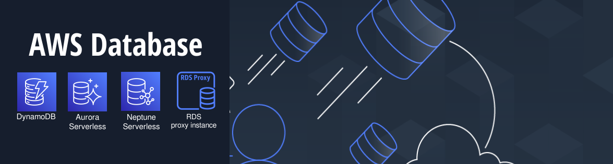

**13. Amazon DynamoDB** 
Um banco de dados NoSQL totalmente gerenciado e serverless, que oferece escalabilidade automática e alta disponibilidade. É ideal para aplicações que requerem latência baixa e que precisam lidar com grandes volumes de dados.

**14. O Amazon RDS Proxy** 
O Amazon RDS Proxy é um serviço de proxy de banco de dados que permite que aplicações se conectem a bancos de dados do Amazon RDS e Amazon Aurora com segurança e resiliência. Ele gerencia a conexão do banco de dados, reduzindo a sobrecarga de gerenciamento de conexões e ajudando a melhorar a escalabilidade, disponibilidade e segurança. Ele é especialmente útil em aplicativos que precisam lidar com picos de carga, pois permite reutilização de conexões e gerenciamento eficiente de recursos.

**15. Amazon Aurora Serverless**
O Amazon Aurora Serverless é uma configuração de banco de dados no Amazon Aurora que oferece um mecanismo de banco de dados relacional que automaticamente ajusta sua capacidade de computação para coincidir com as necessidades do aplicativo. Ele escala automaticamente para cima e para baixo com base no uso, permitindo que você pague apenas pela capacidade que realmente utiliza. É ideal para aplicativos com cargas de trabalho variáveis ou intermitentes.

**16. Amazon Neptune Serverless**
O Amazon Neptune Serverless é uma versão do banco de dados gráfico gerenciado Amazon Neptune que permite que a capacidade do banco de dados escale automaticamente com a demanda. Isso significa que você paga apenas pela capacidade que usa, ideal para aplicações que requerem acesso a dados gráficos de maneira não consistente ou em picos. O Amazon Neptune é otimizado para armazenar e consultar grafos complexos de dados.

**17. DynamoDB Streams**
O DynamoDB Streams é uma funcionalidade associada ao Amazon DynamoDB que registra alterações nos itens em uma tabela DynamoDB. Ele fornece um fluxo de dados em tempo real contendo as inserções, atualizações e exclusões de itens, permitindo que aplicativos ou serviços consumam esses dados e respondam a alterações, possibilitando cenários como replicação, aplicações reativas e processamento assíncrono.

**18. Kinesis Data Streams**
O Kinesis Data Streams é um serviço da AWS que permite coletar e processar dados em tempo real. Ele permite que você crie aplicações que capturem e analisem dados de streaming, como logs, cliques de usuários ou eventos de máquina. Os dados podem ser processados em tempo real usando aplicativos de consumidores de stream, permitindo reações instantâneas a alterações nos dados.

