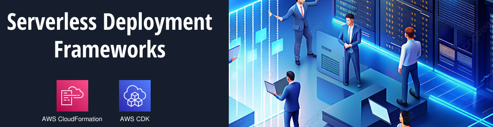

**22. CloudFormation**
AWS CloudFormation é um serviço que permite criar e gerenciar recursos da AWS usando arquivos de modelo. Com ele, você pode definir sua infraestrutura como código, o que facilita a automação do processo de provisionamento e manutenção de recursos na nuvem, permitindo criar, atualizar e excluir ambientes de forma controlada e reproduzível.

**23. AWS CDK (Cloud Development Kit)**
O AWS Cloud Development Kit (CDK) é uma biblioteca de desenvolvimento de software que permite que os desenvolvedores definam sua infraestrutura em várias linguagens de programação, como TypeScript, Python e Java. O CDK gera automaticamente os arquivos de modelo do CloudFormation subjacentes, facilitando a criação de recursos da AWS de forma programática e reutilizável, e integrando-se facilmente com práticas de desenvolvimento moderno.

