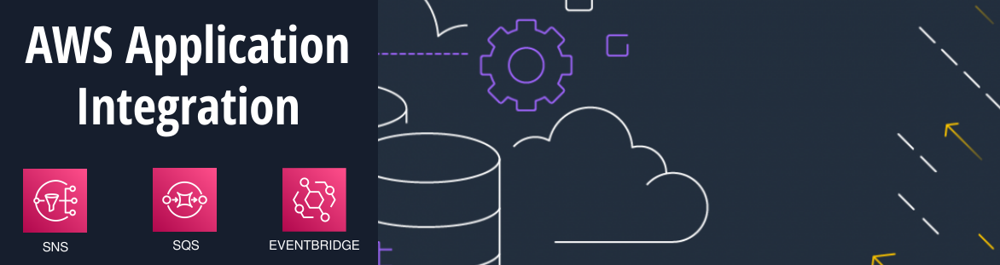
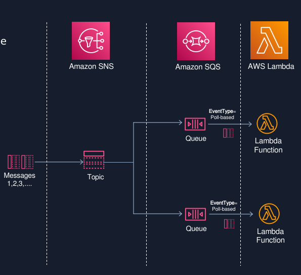
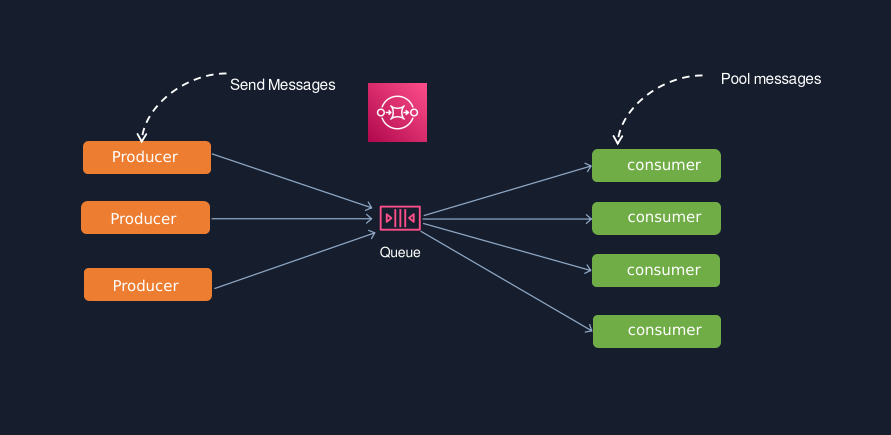
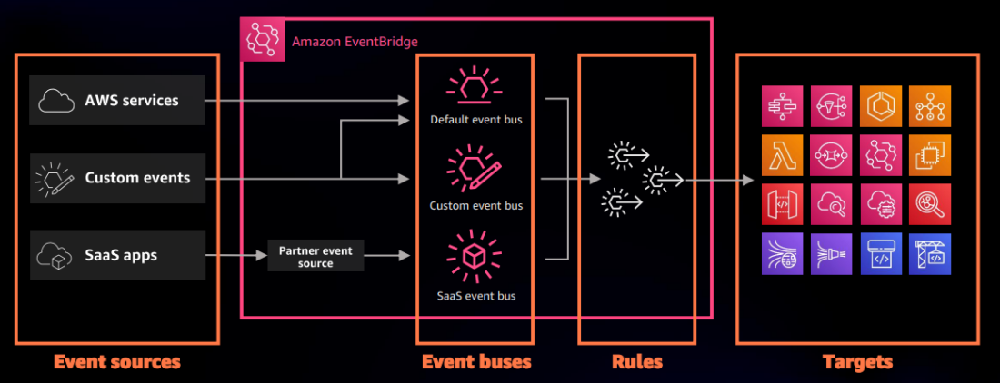
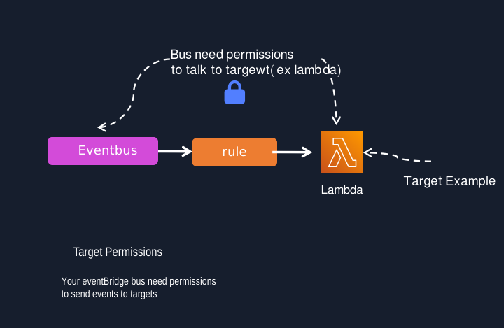
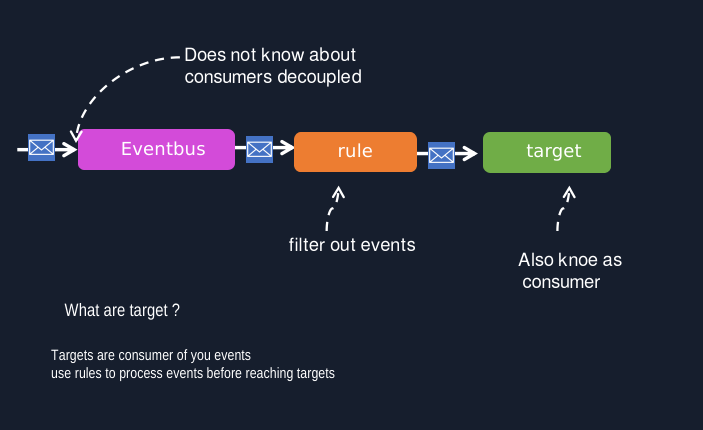

##  **03. Amazon SNS (Simple Notification Service)**

Um serviço de messaging que permite enviar notificações e **mensagens em tempo real para outras aplicações**. Pode ser integrado ao **AWS Lambda para processar** mensagens em **tempo real**.

## **Funcionalidades do AWS SNS**

### **A - Publicação e Assinatura:**

- O SNS opera no modelo de publicação/assinatura, onde você pode publicar mensagens em um tópico, e os assinantes desse tópico recebem essas mensagens. Isso permite uma comunicação eficiente entre diferentes partes de uma aplicação.
- Notificações de Múltiplos Protocolos
- O SNS suporta vários protocolos para enviar mensagens, incluindo:
    - SMS (Short Message Service)
    - Email e Email-JSON
    - HTTP/HTTPS
    - Amazon SQS (Simple Queue Service)
    - Lambda (para executar funções)
    - Aplicativos móveis (como Firebase Cloud Messaging)

### **B - JSON e Formatação de Mensagens:** 

- Você pode formatar mensagens usando JSON, permitindo que você inclua informações estruturadas de forma clara, o que é ideal para sistemas que requerem interações mais complexas.

### **C -Escalabilidade:** 

- O SNS é altamente escalável, permitindo que você envie mensagens para milhões de assinantes simultaneamente, sem se preocupar com a infraestrutura.

### **D -Filtros de Assinatura:** 

- Com os filtros de assinatura, você pode definir quais mensagens um assinante específico deve receber, com base em atributos das mensagens, aumentando a flexibilidade e a eficiência na entrega de informações relevantes.

### **E -Monitoramento e Alerta:** 

- Você pode usar o Amazon CloudWatch para monitorar métricas do SNS, como o número de mensagens publicadas e entregues, configurando alarmes para determinadas condições.

### **F -Retenção de Mensagens:** 

- O SNS não retém mensagens; se um assinante não puder receber uma mensagem (por exemplo, se estiver offline), a mensagem será descartada. Para casos onde a retenção é necessária, o SNS pode ser integrado ao SQS.

### **G -Regiões Geográficas:** 
- O SNS está disponível em várias regiões da AWS, permitindo que você entregue mensagens de forma global e com baixa latência a seus assinantes.

##  **04. Amazon SQS (Simple Queue Service)** 

- Um serviço de filas que permite desacoplar e escalar microserviços, aplicações distribuídas e sistemas em nuvem. O SQS pode trabalhar em conjunto com o Lambda **para processar mensagens de uma fila**

- Amazon Simple Queue Service (SQS) é um serviço de fila de mensagens que permite que aplicativos e sistemas se comuniquem de maneira assíncrona e escalável. O SQS é particularmente útil em arquiteturas baseadas em microserviços e em cenários onde as operações precisam ser **desacopladas e escaláveis**. 

## **Funcionalidades do AWS SQS**

### **A - Desacoplamento de Componentes:**

- O SQS permite que diferentes partes de uma aplicação se comuniquem de forma assíncrona, o que facilita o desacoplamento de componentes, permitindo que cada parte do sistema funcione independentemente.

### **B - Escalabilidade:**

- O SQS é altamente escalável, capaz de lidar com grandes volumes de mensagens sem qualquer necessidade de provisionamento. Você pode enviar, receber e processar mensagens em qualquer quantidade.

### **C - Modelos de Fila:**

- O SQS oferece dois tipos principais de filas:
    - **Standard Queue:** 
        - Oferece entrega garantida de mensagens e pode fornecer duplicatas em casos de falha. 
        - É ideal para a maioria das aplicações onde a ordem das mensagens não é crítica e alta escalabilidade é necessária.
    - **FIFO Queue (First-In-First-Out):** 
        - Garante que as mensagens sejam entregues exatamente uma vez e na ordem em que foram enviadas. 
        - Isso é essencial para cenários em que a ordem das mensagens é crítica.

### **D - Garantia de Entrega:**

- O SQS garante que as mensagens sejam entregues pelo menos uma vez. Com as filas FIFO, a entrega é garantida exatamente uma vez, o que elimina a duplicação de mensagens.

### **E - Retenção de Mensagens:**

- As mensagens podem ser retidas na fila por até 14 dias, permitindo que os consumidores processem as mensagens em seu próprio ritmo.

### **F - Visibilidade de Mensagens:**

- O SQS permite que mensagens sejam ocultadas temporariamente de outros consumidores após serem recuperadas para processamento, o que ajuda a evitar duplicação durante o processamento.

### **G - Integração com Outros Serviços da AWS:**

- O SQS se integra bem com outros serviços da AWS, como AWS Lambda, Amazon EC2 e Amazon SNS, permitindo a construção de arquiteturas de aplicações complexas.

### **H - Segurança:**

- O SQS oferece recursos de segurança, incluindo criptografia em trânsito e em repouso, e permite controle de acesso com o IAM (Identity and Access Management), garantindo que apenas entidades autorizadas possam acessar as filas.

### **I - Monitoramento e Alerta:**

- O SQS se integra ao Amazon CloudWatch, permitindo que você monitore métricas como o número de mensagens na fila, número de mensagens recebidas e enviadas, e defina alarmes para condições específicas.

## **Casos de Uso do AWS SQS**

### **A - Desacoplamento de Microserviços:**

- O SQS é amplamente utilizado em arquiteturas baseadas em microserviços para permitir que serviços diferentes se comuniquem sem dependências diretas, o que aumenta a resiliência geral do sistema.

### **B - Processamento de Transações em Lote:**

- Em cenários onde é necessário processar grandes volumes de dados em lotes, o SQS pode ser usado para armazenar mensagens até que estejam prontas para serem processadas por um consumidor.

### **C - Gerenciamento de Cargas de Trabalho:**

- O SQS pode ajudar a equilibrar cargas de trabalho, permitindo que tarefas sejam enfileiradas e processadas de forma assíncrona, controlando a taxa de processamento.

### **D - Fila de Trabalho para Processamento de Exportação/Importação:**

- Em aplicações que realizam processos de importação ou exportação de dados, o SQS pode gerenciar as solicitações e garantir que cada uma seja processada de forma ordenada.

### **E - Armazenamento de Mensagens para Desenvolvimento e Teste:**

- O SQS pode ser utilizado em ambientes de desenvolvimento e teste para simular a comunicação entre diferentes componentes de uma aplicação, permitindo que equipes testem suas integrações.

### **F - Notificações de Eventos:**

- O SQS pode ser usado para armazenar notificações ou eventos que são gerados em sua aplicação, permitindo que sistemas ou serviços diferentes processem esses eventos de maneira assíncrona.

### **G - Resiliência e Recuperação de Falhas:**

- Com a capacidade de armazenar mensagens até que possam ser processadas, o SQS permite que aplicações continuem operando em caso de falhas temporárias de serviços ou sistemas.

### **H - Integração com IoT:**

- Em aplicações de Internet das Coisas (IoT), o SQS pode ser utilizado para gerenciar a comunicação entre dispositivos e serviços, coletando dados de dispositivos e enviando-os para processamento.

### **I - Gerenciamento de Fluxos de Trabalho:**

- O SQS pode ser utilizado para gerenciar fluxos de trabalho em que várias etapas devem ser completadas em uma sequência específica, permitindo que cada etapa envie mensagens para a próxima etapa na fila..

##  **05. Amazon EventBridge** 

Um serviço que facilita a criação de arquiteturas orientadas a eventos. Permite que você conecte aplicativos usando eventos de outros serviços da AWS e aplicativos SaaS.

Amazon EventBridge é um serviço de gerenciamento de eventos que facilita a construção de aplicações orientadas a eventos na nuvem da AWS. Com o EventBridge, você pode conectar **diferentes aplicações**, realizar processamento em **tempo real** e criar arquiteturas altamente **escaláveis e desacopladas**. 

##  **Funcionalidades do Amazon EventBridge**

###  **A - Suporte a Eventos de Múltiplas Fontes:**

- O EventBridge pode receber eventos de várias fontes, incluindo serviços da AWS, aplicativos personalizados e **SaaS (Software as a Service)**. 
- Isso permite que você centralize o **gerenciamento de eventos** em um único serviço.

###  **B - Rotas e Regras de Eventos:**

- Você pode **criar regras que filtram** e direcionam eventos para **destinos específicos**. 
- Isso permite um controle detalhado sobre como os **eventos são tratados após serem recebidos**.

###  **C - Múltiplos Destinos de Eventos:**

- Os eventos podem ser enviados a uma ampla gama de destinos, incluindo **AWS Lambda, Amazon SNS, Amazon SQS, AWS Step Functions, Amazon Kinesis, e até mesmo endpoints HTTP**. Isso fornece uma grande flexibilidade na forma como os eventos são processados.

###  **D - Eventos de Esquema:**

- O EventBridge aceita eventos que seguem um esquema definido, permitindo que você trabalhe com dados de forma estruturada. Você pode usar o AWS Schema Registry para gerenciar e versionar esses esquemas.

###  **E - Padrões de Eventos:**

- Você pode usar padrões de eventos para selecionar eventos com base em critérios específicos, permitindo que diferentes partes de sua aplicação respondam a diferentes tipos de eventos de maneira granular.

###  **F - Integração com CloudWatch:**

- O EventBridge se integra ao **Amazon CloudWatch**, permitindo que você monitore eventos e crie alarmes com base em métricas de eventos.

###  **G - Segurança e Controle de Acesso:**

- O EventBridge utiliza o AWS Identity and Access Management (IAM) para controlar o acesso aos eventos, garantindo que apenas entidades autorizadas possam publicar ou processar eventos.

###  **H - Resiliência e Confiabilidade:**

- O EventBridge é projetado para ser altamente disponível e escalável, garantindo que os eventos sejam entregues mesmo em caso de falhas temporárias.

###  **I - Experimentação com Eventos:**

- O serviço permite que você faça testes e experimentações com eventos em seu ambiente, o que pode facilitar a inovação e a prototipagem de soluções.

##  **Casos de Uso do Amazon EventBridge**

###  **A - Arquiteturas Orientadas a Eventos:**

- O EventBridge é ideal para construir arquitetura orientada a eventos, onde diferentes componentes da aplicação podem reagir a eventos de maneira assíncrona e desacoplada.

###  **B - Integração de Aplicações:**

- Você pode usar o EventBridge para integrar diferentes aplicações, facilitando a comunicação entre aplicativos de SaaS, serviços da AWS e sistemas locais.

###  **C - Automação de Fluxos de Trabalho:**

- O EventBridge pode ser usado para acionar fluxos de trabalho em aplicações baseadas em eventos. Por exemplo, eventos gerados por um evento de mudança em um bucket S3 podem iniciar uma execução de AWS Step Functions.

###  **D - Notificações e Alertas:**

- Você pode configurar eventos que disparam notificações em tempo real via SNS ou Lambda, como alertas de sistemas ou notificações de eventos em aplicativos móveis.

###  **E - Processamento de Dados em Tempo Real:**

- O EventBridge pode ser usado para capturar e processar dados em tempo real, como informações de aplicativos de análise, logs de sistema ou dados de IoT.

###  **F - Automação de Respostas a Eventos:**

- Pode-se criar regras que, ao detectar um evento específico (por exemplo, um novo registro em um banco de dados), disparam automaticamente ações ou executam funções em resposta a esse evento.

###  **G - Gerenciamento de Ciclos de Vida de Recursos:**

- O EventBridge pode monitorar e reagir a mudanças nos recursos da AWS, como quando uma instância EC2 é iniciada ou interrompida, permitindo o gerenciamento dinâmico da infraestrutura.

###  **H - Construção de Aplicações SaaS:**

- Para desenvolvedores de SaaS, o EventBridge pode permitir que você integre de maneira eficiente as operações de seus aplicativos, recebendo eventos de usuários e tratando-os imediatamente.

###  **I - Observabilidade e Monitoramento:**

- O EventBridge pode ser utilizado para centralizar eventos de diferentes serviços e aplicações, proporcionando visibilidade sobre o funcionamento da arquitetura e permitindo a detecção rápida de problemas.

###  **J - Coordenação em Aplicações de Microserviços:**

- Em arquiteturas de microserviços, o EventBridge pode ajudar a coordenar a comunicação entre serviços, onde cada serviço publica e consome eventos de forma independente, estabelecendo um fluxo de dados consistente.
