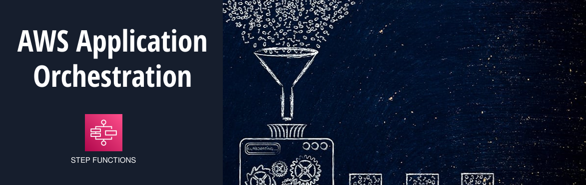

**06. AWS Step Functions** 
Um serviço de orquestração que permite criar fluxos de trabalho complexos para gerenciar aplicações serverless. Ele pode coordernar múltiplas funções Lambda e outros serviços AWS.
