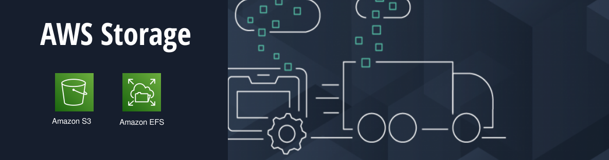

**11. Amazon S3 (Simple Storage Service)** 
Embora não seja exclusivamente um serviço serverless, o S3 é frequentemente usado em arquiteturas serverless para armazenamento de objetos e pode desencadear funções do Lambda em resposta a eventos, como uploads de arquivos.

**12. Amazon EFS (Elastic File System)** é um serviço de armazenamento de arquivos totalmente gerenciado que fornece um sistema de arquivos escalável, baseado em nuvem, para ambientes da AWS. Ele é projetado para ser acessado simultaneamente por várias instâncias do Amazon EC2 e pode ser usado para uma variedade de casos de uso que exigem armazenamento de arquivos compartilhados. 